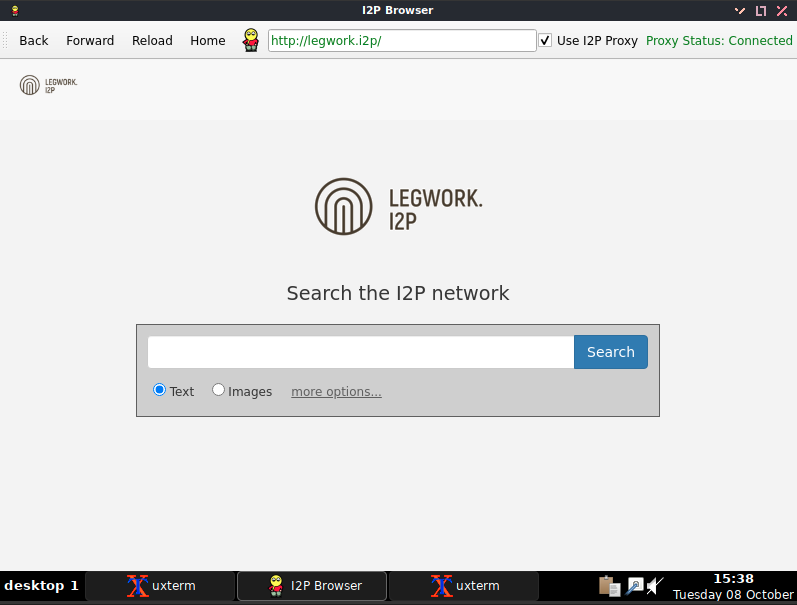
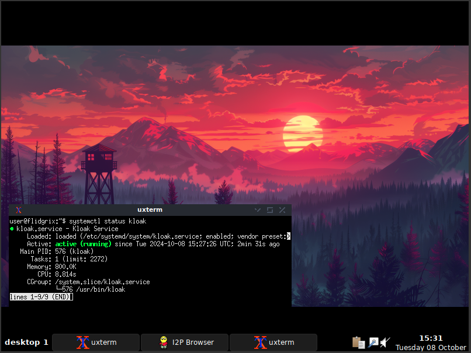
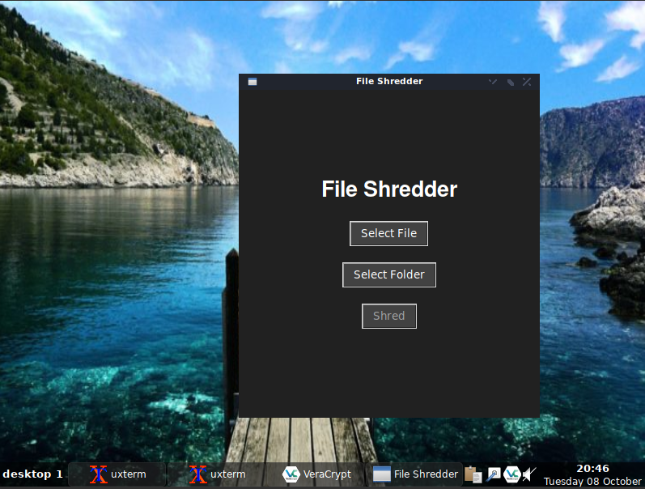

# Flidgrix

## An Amnesic Operating System for I2P Network

<!-- DESCRIPTION -->
## Description:

Amnesic operating systems offer enhanced privacy and security by ensuring that no trace of user activity is left on the device after a session. They achieve this by operating entirely in RAM, which means all data is erased once the system is shut down. This makes them highly resistant to forensic analysis, as no logs, browsing history, or files remain on the machine. Additionally, they often come with built-in encryption tools to safeguard sensitive communications and data during use. These features are particularly beneficial for users who prioritize anonymity, want to bypass censorship, or need to protect their privacy in high-risk environments.

<!-- FEATURES -->
## Features:

- Forgets all data after shutdown

- Security and privacy tools pre-installed

- Cool wallpapers

<!-- INSTALLATION -->
## Installation:

[Download](https://github.com/umutcamliyurt/Flidgrix/releases)

<!-- SCREENSHOTS -->
## Screenshots:

*Image 1: I2P Browser*

*Image 2: Kloak (Keystroke-level online anonymization kernel)*

*Image 3: File Shredder*

<!-- LICENSE -->
## License

Distributed under the MIT License. See `LICENSE` for more information.
